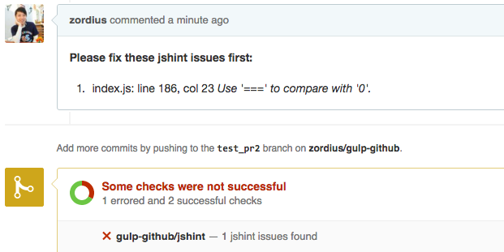

gulp-github
===========

A gulp plugin to comment jscs/jshint/eslint issues to a github pull request.

[](https://www.npmjs.org/package/gulp-github) [](https://david-dm.org/zordius/gulp-github) [](https://travis-ci.org/zordius/gulp-github) [](LICENSE.txt)

Features
--------

* See your CI issues of lint tools on github!
  * Collect <a href="https://github.com/spenceralger/gulp-jshint">gulp-jshint</a> results.
  * Collect <a href="https://github.com/jscs-dev/gulp-jscs">gulp-jscs</a> results.
  * Collect <a href="https://github.com/adametry/gulp-eslint">gulp-eslint</a> results.
  * Write collected info then comment on a github pull request.
  * Update github pull request status based on collected info.
* A failThisTask() reporter to fail a gulp task when jscs/jshint/eslint issues found
* **TODO** Collect lcov result.



Installation
------------

```sh
npm install gulp-github
```

Usage
-----

```javascript
var gulp = require('gulp'),
    jshint = require('gulp-jshint'),
    jscs = require('gulp-jscs'),
    eslint = require('gulp-eslint'),
    github = require('gulp-github');

gulp.task('link_report_github', function () {
    return gulp.src('lib/*.js')
    .pipe(jshint())
    .pipe(jscs()).on('error', function (E) {
        console.log(E.message);   // This handled jscs stream error.
    })
    .pipe(eslint())
    .pipe(github(options));       // Comment issues in github PR!
    .pipe(github.failThisTask()); // Fail this task when jscs/jshint/eslint issues found.
});

// Or, direct output your comment with same options
github.commentToPR('Yes! it works!!', options);

// Or, direct set status to a commit
github.createStatusToCommit({
   description: 'No! 2 failures...',
   context: 'my gulp task',
   state: 'failure'
}, options);

// Or, create a task to reject PR with merged commits
gulp.task('git_rules', function (cb) {
    git.failMergedPR(options, cb);
});
```

Options
-------

```javascript
{
    // Required options: git_token, git_repo
    // refer to https://help.github.com/articles/creating-an-access-token-for-command-line-use/
    git_token: 'your_github_oauth_token',

    // comment into this repo, this pr.
    git_repo: 'zordius/test',
    git_prid: '1',

    // create status to this commit, optional
    git_sha: 00000000,
    jshint_status: 'error',       // Set status to error when jshint errors, optional
    jscs_status: 'failure',       // Set git status to failure when jscs errors, optional
    eslint_status: 'error',       // Set git status to error when eslint errors, optional

    // when using github enterprise, optional
    git_option: {
        // refer to https://www.npmjs.com/package/github
        host: 'github.mycorp.com'
    },

    // Provide your own jshint reporter, optional
    jshint_reporter: function (E, file) { // gulp stream file object
        // refer to http://jshint.com/docs/reporters/ for E structure.
        return 'Error in ' + E.file + '!';
    },

    // Provide your own jscs reporter, optional
    jscs_reporter: function (E, file) { // gulp stream file object
        // refer to https://github.com/jscs-dev/node-jscs/wiki/Error-Filters for E structure.
        return 'Error in ' + E.filename + '!';
    }
}
```

Check this <a href="gulpfile.js">sample gulpfile</a> to see how to migrate this with travis CI.

Check <a href="https://github.com/zordius/gulp-github/pull/4">This PR</a> to see live demo.
